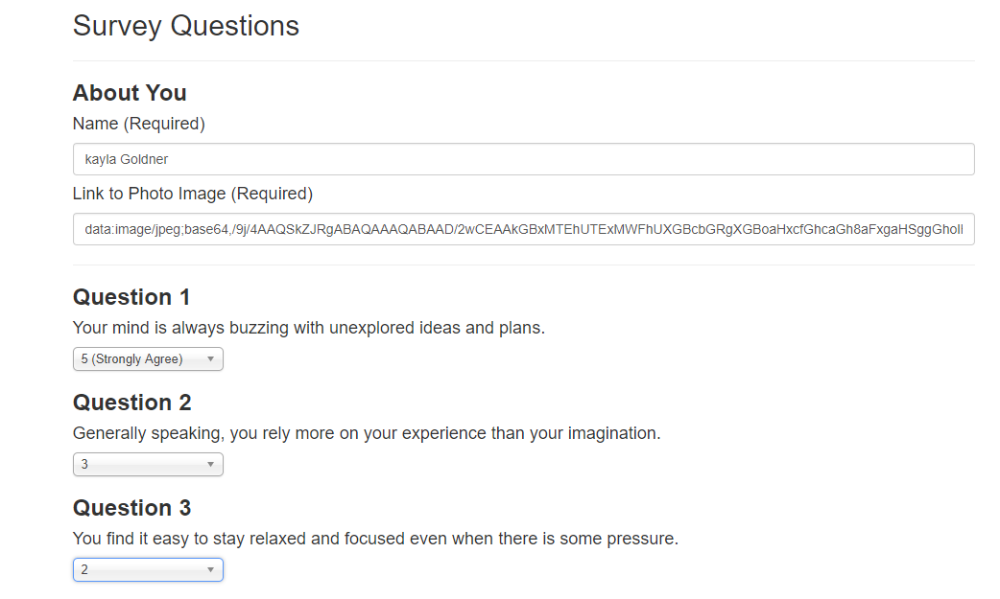

# **FriendFinder ** #

This is a compatibility-based "FriendFinder" application -- basically a dating app. This full-stack site will take in results from your users' surveys, then compare their answers with those from other users. The app will then display the name and picture of the user with the best overall match.

## Technologies Used ##
-Express Servers

-Node.js

-JavaScript

## npm Packages: ##
- [express]( https://www.npmjs.com/package/express "express") - Provides small, robust tooling for HTTP servers, making it a great solution for single page applications, web sites, hybrids, or public HTTP APIs.
- [body-parser]( https://www.npmjs.com/package/body-parser "body-parser") - Parses incoming request bodies in a middleware before your handlers, available under the req.body property.
- [path]( https://www.npmjs.com/package/path "path") - This is an exact copy of the NodeJS ’path’ module published to the NPM registry.

## How it works: ##
- Step 1: On the Home page of the Friend Finder app, click “Go to Survey” button.
- Step 2: The app will take the user to the Survey Questions page. The user will need to fill out the form “About You” by inputting the user’s name and a link to their photo image (both required).
- Step 3: The user will answer 10 questions. Each answer is based on a scale from 1 to 5. A “1” is “Strongly Disagree” and a “5” is a “Strongly Agree” option.
- Once all 10 questions have been answered, the user will submit the form.
- Once the survey has been submitted, the user will receive a modal pop-up of their best match with a name and photo.

.png)

